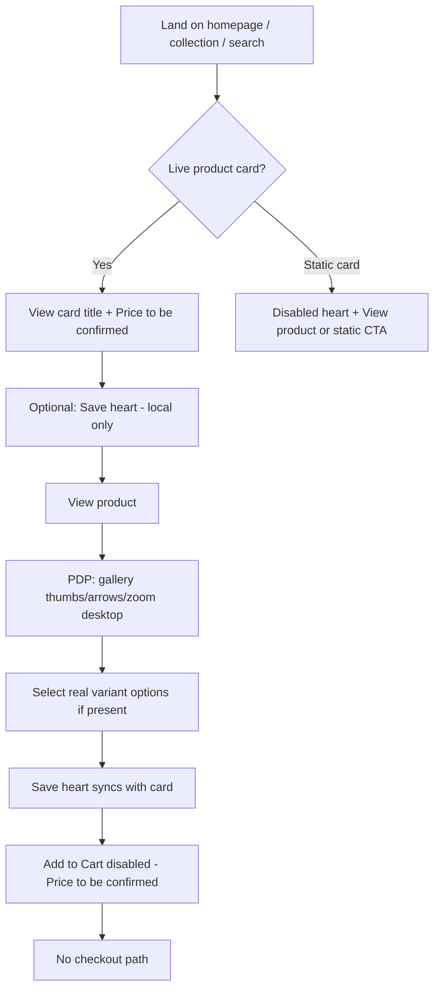

# Slice 21FP-B — UI/UX handoff (wishlist, PDP gallery, variants, copy)

**Document type:** UI/UX handoff draft (documentation only)  
**Prepared:** 2026-05-22  
**Owner:** Product Owner / QA (draft); implementation owner TBD  
**Slice:** **21FP-B**  
**Upstream:** **21FP-A** read-only discovery (`ea49612` baseline)

**Constraints:** No Shopify Admin mutation, no theme push, no publish, no checkout/cart/payments, no Supplier verified or delivery/stock/warranty certainty claims, no apps, no account or server wishlist, commerce gate preserved.

---

## Product Owner decisions (recorded)

| # | Decision |
| --- | --- |
| 1 | **Wishlist chrome alignment:** **Option A — “Saved items”** vocabulary for header, nav, footer, and aligned heart `aria-label` strings. Retire “Favourites paused” / “Save feature coming later” on global chrome. |
| 2 | **Product card and PDP hearts:** Remain **local-only** using **existing** behaviour (`snippets/wishlist-button.liquid`, `assets/wishlist-local.js`, `localStorage` key `mzansi-wishlist-v1`). No account wishlist, no server wishlist, no customer data collection. |
| 3 | **Header / nav / footer:** Stay **non-navigating** (no link to a wishlist page, no list view). A dedicated wishlist page requires a **future** Product Owner approval—not in this handoff. |
| 4 | **PDP gallery** (hover zoom, thumbnails, prev/next arrows, keyboard, mobile no-zoom): **No theme implementation** in the next pass unless **QA files a defect** against current MVP behaviour. This document is spec confirmation only. |
| 5 | **Colour / variant selection:** Use **only** real Shopify `product.options_with_values` / `product.variants` data. **Do not** invent hex swatch colours or fake option values. |
| 6 | **Copy cleanup:** The **3** deferred supplier-proof products remain a **separate Admin-only** Product Owner approval pack (**21FK** §7). **Not** theme work and **not** bundled with chrome alignment. |

---

## 1. Problem framing

The MVP theme already ships **working** local-only wishlist hearts on live product cards and PDPs, plus a **working** PDP gallery (thumbs, arrows, desktop hover zoom) and **real** Shopify variant option selectors. Global chrome (header, mobile nav, footer) still tells shoppers that favourites are **paused**, which contradicts on-product behaviour and erodes trust during password-gated preview.

Copy cleanup for the visible catalogue is largely complete in Admin (**21FN**); **three** supplier-proof products still need a **separate** Admin approval pack—not a theme fix.

---

## 2. User goal

| Goal | Success looks like |
| --- | --- |
| Save products to revisit later | Tap heart on card or PDP; state persists in **this browser only**; same product shows saved on reload and across card/PDP for that handle |
| Understand preview limits | Clear that wishlist is **not** an account, **not** shared across devices, and **not** linked to checkout |
| Browse product images | Switch images via thumbnails or arrows; on desktop, inspect detail with hover zoom where supported |
| Choose colour/size where offered | See only real option values from the catalogue; unavailable combinations are obvious and not selectable |
| Read trustworthy copy | Short, South African English titles and descriptions without import keyword stuffing |

---

## 3. Business goal

| Goal | How this handoff supports it |
| --- | --- |
| Honest restricted preview | Messaging matches actual behaviour; no implied checkout, account, or Supplier verified claims |
| Low implementation risk | Theme-only copy/chrome alignment and small state polish—no new services or data collection |
| Preserve commerce gate | No Add to Cart, no cart forms, no payment paths; **Price to be confirmed** unchanged |
| Defer risky copy | **3** deferred SKUs stay on Admin-only path until supplier proof |

---

## 4. Wishlist UX alignment

### Current state (21FP-A)

| Surface | State |
| --- | --- |
| `live-product-card`, PDP `wishlist-button` | **Active** — `localStorage` `mzansi-wishlist-v1`, delegated click, `aria-pressed`, `.is-saved` |
| `site-header`, `primary-navigation`, `site-footer` | **Deferred copy** — “Favourites paused” / “Save feature coming later” |
| `static-product-card` | Disabled heart (static homepage tiles only) |

### Recommended behaviour

| Rule | Detail |
| --- | --- |
| Scope | **Browser-local save list only** — max 50 handles with `title` + `url`; no email, login, sync, or backend |
| Surfaces | Keep hearts on **live** cards and PDP; do **not** enable header icon as navigation to a wishlist page (no list page in scope) |
| Header / nav / footer | Replace “paused” with **honest preview wording** (see below); remain **non-interactive** `` or `button type="button"` that does not navigate—optional: scroll to first saved item is **out of scope** |
| Static cards | Keep disabled hearts and existing deferred labels |

### Approved wording — Option A “Saved items” (South African English)

Vocabulary: **Saved items** (noun), **Save** / **Saved** (control). Do not use “Favourites paused” alongside active hearts. Align header, nav, footer, and `wishlist-button` `aria-label` strings in one implementation pass.

| Location | Visible label | `aria-label` (if icon-only) |
| --- | --- | --- |
| Desktop header | `Saved` (non-clickable hint) | `Saved items on this device only. Sign-in not available in preview.` |
| Mobile nav | `Saved` | Same as desktop |
| Footer link row | `Saved on this device` | — |
| Footer supporting line (one sentence) | `Hearts on product pages save items in this browser only. No account or checkout yet.` | — |
| PDP / card heart | Icon only; **existing** toggle behaviour | `Add {product} to saved items` / `Remove {product} from saved items` |

**Product/PDP hearts (unchanged implementation):** Keep `data-wishlist-toggle`, delegated click in `wishlist-local.js`, `aria-pressed`, `.is-saved`, and storage shape `{ handle, title, url }` only—no backend, no login, no email.

**Global chrome (unchanged interaction model):** Header, mobile nav, and footer entries remain **non-navigating** until a future PO-approved wishlist page exists; they are honest labels only, not links to a saved-items view.

### Visual / interaction states (hearts — already largely implemented)

| State | Class / attribute | Notes |
| --- | --- | --- |
| Default | `aria-pressed="false"` | Outline heart |
| Saved | `.is-saved`, `aria-pressed="true"` | Filled or accent stroke per `theme.css` |
| Focus | `:focus-visible` ring (existing) | Must remain on heart button |
| Hover | Existing card hover reveal | Keep heart reachable on keyboard |

### Accessibility (wishlist)

- Hearts must stay **`<button type="button">`**, not links.
- Do not rely on colour alone: use `aria-pressed` + label change.
- No toast that blocks focus order; optional `aria-live="polite"` on first save only if PO wants explicit feedback—**default: no new live region** (label change is enough).

---

## 5. PDP gallery

**Implementation posture:** Current MVP gallery (`main-product-foundation.liquid`, `product-gallery.js`, `theme.css`) is **accepted as-is**. **No code changes** in the next theme pass unless QA documents a reproducible defect (broken arrows, thumbs, keyboard, or zoom). Optional helper copy below remains **off** by default.

### Desired user-facing behaviour (confirm as spec)

| Feature | Desktop (fine pointer) | Mobile / touch |
| --- | --- | --- |
| **Main image** | Single large image; `object-fit: cover` | Same |
| **Thumbnails** | Row/grid; click selects image; active border (`is-active` / `aria-selected`) | 2-column strip; tap to select |
| **Previous / next** | Overlay arrows on main image when **≥ 2** images; disabled when only one | Same arrows (smaller); no hover zoom |
| **Hover zoom** | Magnified pane follows cursor on main image | **Off** (zoom pane hidden in CSS)—users use thumbs/arrows only |
| **Keyboard** | Focus gallery (`tabindex="0"`); **Left/Right** change image when ≥ 2 | Thumbs focusable; Enter/Space selects |
| **Reduced motion** | Respect `prefers-reduced-motion`: keep image swap; zoom may remain off if already gated in JS | N/A |

### Helper copy (only if PO wants—optional, minimal)

| Placement | Copy (if added) |
| --- | --- |
| Below thumb strip (multi-image only) | `Select a thumbnail or use the arrows to view more images.` |
| Single image | **No** arrow copy; **no** empty thumb strip messaging |

**Recommendation:** **Skip** helper copy for launch slice unless QA reports confusion; behaviour is standard.

### Visual state improvements (optional, low risk)

| Item | Recommendation |
| --- | --- |
| Arrow disabled state | Keep reduced opacity when `media.length < 2` (already in JS) |
| Active thumb | Keep gold border + `aria-selected="true"` |
| Focus | Ensure thumb and arrow `:focus-visible` match design system (gold outline) |

### Out of scope (gallery)

- Pinch-zoom lightbox, 360°, video, or new media uploads.
- Changing Admin media or variant images.

---

## 6. Colour / variant selection

**Implementation posture:** Keep existing `product-options-preview.js` and Liquid option loop. **No** new swatch colours or fake options in the next pass—only confirm states and QA if unavailable combinations fail.

### Data rule (non-negotiable)

- Options and values **only** from `product.options_with_values` / `product.variants`.
- Colour-like names: `color`, `colour` (case-insensitive) → swatch **buttons labelled with the exact option value string**.
- **Do not** add hex swatches, invented colours, or `data-fake-colour` rows.

### Recommended states

| State | Class / behaviour | User perception |
| --- | --- | --- |
| **Selected** | `.is-active`, `aria-pressed="true"` | Current preview selection |
| **Available** | Enabled button | Can tap to preview combination |
| **Unavailable** | `.is-unavailable`, `disabled`, `aria-pressed="false"` | Greyed; not selectable |
| **Focus** | `:focus-visible` on chip/swatch | Keyboard path clear |

### Interaction

- Click updates **preview only** (gallery image via `featuredSrc` / thumb); **no** add to cart, **no** URL variant deep-link required in this slice.
- Unavailable combination: button stays disabled after sibling options change (existing JS).

### Accessibility (variants)

- Each option group needs visible **option name** label (existing `.product-option-label`).
- Swatches use **visible text** inside button (`.product-option-swatch-label`) plus `title` attribute for long values—do not rely on colour disk alone.

### Optional later enhancement (explicitly out of 21FP-B implementation)

- Visual swatch disk using **variant featured image** thumbnail only when `variant.featured_media` exists—still no hex invention.

---

## 7. Copy cleanup

| Item | Owner | Channel |
| --- | --- | --- |
| **12** products updated | **Done** (**21FN**) | Shopify Admin `title` + `descriptionHtml` |
| **3** deferred supplier-proof products | **Product Owner** | **Separate Admin-only** approval pack per **21FK** §7 — **not** theme; **not** part of wishlist chrome or gallery work |

**Explicit boundary:** Imported title/description cleanup for the deferred **3** SKUs is **Admin mutation only** after a new PO sign-off. Theme files must continue to output `product.title` and `product.description` from Shopify with no hard-coded replacements.

**Deferred handles (no theme copy rewrite):**

1. `low-delay-wireless-tws-games-sports-headset`
2. `modern-kitchen-accessories-soap-dispenser-set-liquid-hand-soap-dispenser-pump-bottle-brushes-holds-and-stores-sponges-scrubbers-1`
3. `soap-dispenser-box-press-dispenser-scrubbing-liquid-container-kitchen-bathroom-automatic-detergent-foam-box-with-sponge-holder-1`

Theme must continue to render `product.title` and `product.description` from Shopify—no hard-coded product copy in Liquid for these SKUs.

---

## 8. Recommended flow (preview shopper)

---

## 9. Component / file map (implementation reference)

| Concern | Primary files |
| --- | --- |
| Wishlist active UI | `snippets/wishlist-button.liquid`, `assets/wishlist-local.js`, `snippets/live-product-card.liquid`, `sections/main-product-foundation.liquid` |
| Wishlist chrome alignment | `sections/site-header.liquid`, `sections/primary-navigation.liquid`, `sections/site-footer.liquid` |
| PDP gallery | `sections/main-product-foundation.liquid`, `assets/product-gallery.js`, `assets/theme.css` |
| Variant preview | `sections/main-product-foundation.liquid`, `assets/product-options-preview.js` |
| Script load | `layout/theme.liquid` (product-only gallery/options scripts) |
| Commerce gate | `snippets/product-commerce-gate.liquid`, card inline tags, disabled `add-btn` |

---

## 10. Out of scope (21FP-B implementation)

- Account login, customer wishlist, email capture, wishlist URL/page.
- Server sync, cross-device saved list, analytics identity.
- Checkout, cart, dynamic checkout, Shop Pay, quick-add.
- Supplier verified badge, delivery/stock/warranty promises.
- Admin product edits (including deferred **3** copy).
- Theme publish policy change, full theme push, Horizon template work.
- Hex colour swatches or fake variant values.
- New dependencies or apps.

---

## 11. Minimal implementation scope (next Codex / theme pass)

**Target: small, bounded theme diff only.**

| # | Change | Files | Est. risk |
| --- | --- | --- | --- |
| 1 | Replace header/nav/footer deferred wishlist **copy** with **Option A “Saved items”**; keep **non-navigating** chrome (no wishlist page link) | `site-header.liquid`, `primary-navigation.liquid`, `site-footer.liquid` | Low |
| 2 | Align `wishlist-button.liquid` `aria-label` strings to Option A; **do not** change `wishlist-local.js` storage contract | `wishlist-button.liquid` | Low |
| 3 | **No** gallery JS/CSS change unless QA files a defect—spec above is confirmation only | — | — |
| 4 | **No** variant logic change unless unavailable state fails QA—spec confirmation only | — | — |
| 5 | Verify commerce gate regression on `/`, search, one multi-image PDP, one colour-variant PDP | Read-only QA harness / manual unlock | Low |

**Do not** include deferred **3** product copy in this pass.

---

## 12. Recommended next owner

| Step | Owner |
| --- | --- |
| Wishlist wording (**Option A “Saved items”**) | **Recorded** — Product Owner (**21FP-B**) |
| Implement theme copy alignment (items 1–2) | **Senior Full-Stack / Theme engineer** (Codex or Cursor per programme) |
| Rendered regression (commerce + wishlist + gallery spot-check) | **QA / Test Engineer** |
| Deferred **3** SKU Admin copy pack | **Product Owner** → separate Admin slice when supplier proof ready |

---

## 13. Acceptance criteria (post-implementation QA)

- Header/nav/footer **do not** say wishlist is “paused” while card/PDP hearts work.
- Heart toggle still writes only `mzansi-wishlist-v1` with handle/title/url; reload persists.
- **0** Add to Cart enablement; **Price to be confirmed** still visible on gated products.
- Multi-image PDP: thumbs + arrows + keyboard; mobile no zoom pane; single-image PDP no broken empty controls.
- Colour options show real values only; unavailable options disabled.
- No Supplier verified or delivery certainty copy introduced.

---

## 14. Safety

No passwords, tokens, customer data, or storefront credentials belong in this document.
